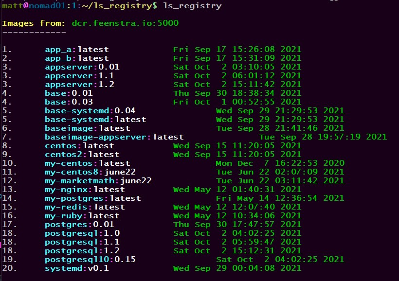

# ls_registry

List all the images within your private Docker Registry

matt.a.feenstra@gmail.com

Licensed under GPLv3, all rights reserved

-----------

### Information

The program requires gems `json`, `colorize` and `time` -- all standard Ruby.

However, if you need to install, do so with the following (CentOS example):

```sh

dnf install -u rubygems

gem install json colorize time

```
### Configuration and Usage

##### Option 1 - Specify registry host every time

Specify your registry host as a parameter on the command line:



##### Option 2 - Set your registry host in the script

Edit the file and set your registry in the `MY_REGISTRY` variable:


